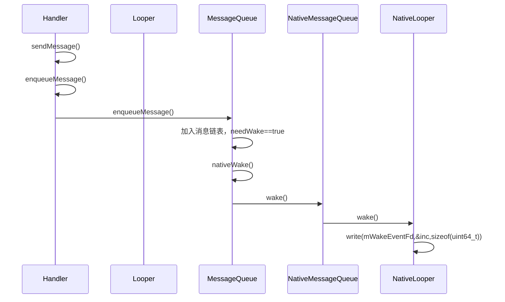
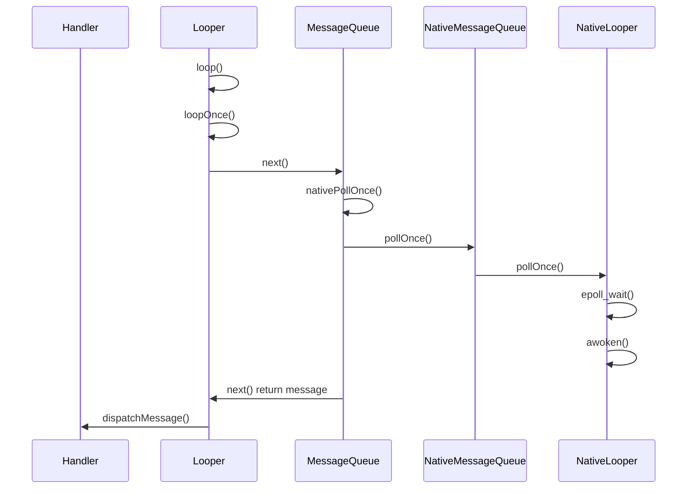

# 概述

Handler机制是Android平台的线程间通讯机制，也是消息循环的基石。Handler机制主要由`Handler`、`Looper`、`MessageQueue`这几个类共同协作完成消息发送、消息队列、消息处理。

Java层Handler机制的实现方面依赖Native，其中Java层实现了Handler、Looper、和MessageQueue。Handler、Looper都是纯Java实现，而Message通过mPtr字段持有了Native层MessageQueue类的指针。在Java层实现Handler实现中，Message负责维护一个Message链表，消息循环的阻塞和唤醒则由Native实现。

# 发送消息过程分析


# 接收消息过程分析



Java层Handler最核心的方法是MessageQueue中的`MessageQueue.next()`:
```java
Message next() {
        // Return here if the message loop has already quit and been disposed.
        // This can happen if the application tries to restart a looper after quit
        // which is not supported.
        // Native层MessageQueue销毁了就直接返回null；
        final long ptr = mPtr;
        if (ptr == 0) {
            return null;
        }

        int pendingIdleHandlerCount = -1; // -1 only during first iteration
        int nextPollTimeoutMillis = 0;
        for (;;) {
            // 阻塞前先执行未完成的binder命令
            if (nextPollTimeoutMillis != 0) {
                Binder.flushPendingCommands();
            }
            // Native方法，阻塞在Looper.mWakeEventFd上面
            // 直到调用Looper.wake()唤醒
            nativePollOnce(ptr, nextPollTimeoutMillis);

            // 唤醒之后找到消息链表的第一个消息
            // 消息链表是个有序的链表，依据Message.when从小到大排序。
            // 所以enqueueMessage()的插入操作其实是个时间复杂度为O(N)的操作
            synchronized (this) {
                // Try to retrieve the next message.  Return if found.
                final long now = SystemClock.uptimeMillis();
                Message prevMsg = null;
                Message msg = mMessages;
                // 消息头是个同步屏障，这说明此时视图正在更新，此时只允许后面的异步消息执行，同步消息不能执行
                if (msg != null && msg.target == null) {
                    // Stalled by a barrier.  Find the next asynchronous message in the queue.
                    // 异步消息一般是Input(TouchEvent或者KeyEvent)或渲染相关的消息
                    do {
                        prevMsg = msg;
                        msg = msg.next;
                        //找到下一条异步消息，跳出循环
                    } while (msg != null && !msg.isAsynchronous());
                }
                if (msg != null) {
                    if (now < msg.when) {
                        // Next message is not ready.  Set a timeout to wake up when it is ready.
                        nextPollTimeoutMillis = (int) Math.min(msg.when - now, Integer.MAX_VALUE);
                    } else {
                        // Got a message.
                        mBlocked = false;
                        if (prevMsg != null) {
                            prevMsg.next = msg.next;
                        } else {
                            mMessages = msg.next;
                        }
                        msg.next = null;
                        if (DEBUG) Log.v(TAG, "Returning message: " + msg);
                        msg.markInUse();
                        //返回这个msg
                        return msg;
                    }
                } else {
                    // No more messages.
                    nextPollTimeoutMillis = -1;
                }

                // Process the quit message now that all pending messages have been handled.
                // 调用了quit(true)方法
                if (mQuitting) {
                    dispose();
                    return null;
                }

                // If first time idle, then get the number of idlers to run.
                // Idle handles only run if the queue is empty or if the first message
                // in the queue (possibly a barrier) is due to be handled in the future.
                // 当前没有消息需要执行，那么尝试执行IdleHandler
                if (pendingIdleHandlerCount < 0
                        && (mMessages == null || now < mMessages.when)) {
                    pendingIdleHandlerCount = mIdleHandlers.size();
                }
                if (pendingIdleHandlerCount <= 0) {
                    // No idle handlers to run.  Loop and wait some more.
                    mBlocked = true;
                    continue;
                }

                if (mPendingIdleHandlers == null) {
                    mPendingIdleHandlers = new IdleHandler[Math.max(pendingIdleHandlerCount, 4)];
                }
                mPendingIdleHandlers = mIdleHandlers.toArray(mPendingIdleHandlers);
            }

            // Run the idle handlers.
            // We only ever reach this code block during the first iteration.
            // 逐个执行IdleHander
            for (int i = 0; i < pendingIdleHandlerCount; i++) {
                final IdleHandler idler = mPendingIdleHandlers[i];
                mPendingIdleHandlers[i] = null; // release the reference to the handler

                boolean keep = false;
                try {
                    keep = idler.queueIdle();
                } catch (Throwable t) {
                    Log.wtf(TAG, "IdleHandler threw exception", t);
                }

                if (!keep) {
                    synchronized (this) {
                        mIdleHandlers.remove(idler);
                    }
                }
            }

            // Reset the idle handler count to 0 so we do not run them again.
            pendingIdleHandlerCount = 0;

            // While calling an idle handler, a new message could have been delivered
            // so go back and look again for a pending message without waiting.
            nextPollTimeoutMillis = 0;
        }
    }
```

*关于Native层实现方面需要注意的是，Native层Looper在Android 6.0以前mWakeEventFd唤醒fd是使用管道实现的，管道的两端分别用来读和写。6.0以后使用`eventfd()`这个系统调用生成一个专门用来事件通知的fd，两者都是通过epoll来实现阻塞和唤醒功能。*