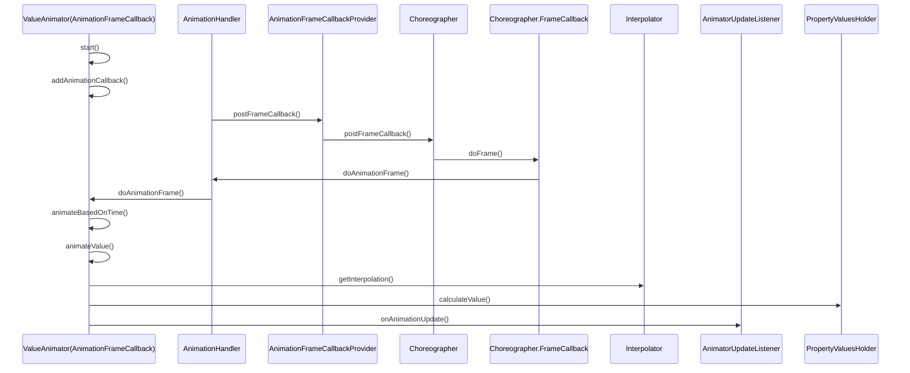

# 概述

在Android 3.0之前，只有两种动画，分别为逐帧动画（Frame Animation）和补间动画（Tween Animation）。从Android 3.0开始，Android开始支持属性动画（Property Animation）。Android 4.4开始支持Transition动画。

# 逐帧动画（Frame Animation）
逐帧动画使用AnimationDrawable实现，可以通过xml和代码实现。

xml:
```
<animation-list xmlns:android="http://schemas.android.com/apk/res/android"
android:oneshot="false">

<!--oneshot是否重复执行动画,false表示只执行一次，true表示执行
    item帧动画顺序，drawable帧图片，duration动画持续时长-->

<item android:drawable="@drawable/a" android:duration="150"></item>
<item android:drawable="@drawable/b" android:duration="150"></item>
<item android:drawable="@drawable/c" android:duration="150"></item>
<item android:drawable="@drawable/d" android:duration="150"></item>


</animation-list>

```
代码:
```
ImageView imageView = findViewById(R.id.iv);
AnimationDrawable animationDrawable = new AnimationDrawable();
Drawable a = getResources().getDrawable(R.drawable.a);
Drawable b = getResources().getDrawable(R.drawable.b);
Drawable c = getResources().getDrawable(R.drawable.c);
Drawable d = getResources().getDrawable(R.drawable.d);
animationDrawable.addFrame(a,120);
animationDrawable.addFrame(b,120);
animationDrawable.addFrame(c,120);
animationDrawable.addFrame(d,120);

imageView.setBackgroundDrawable(animationDrawable);
animationDrawable.setOneShot(false);
//动画开始
animationDrawable.start();
//停止
animationDrawable.stop();

```


# 补间动画（Tween Animation）

指定开始和结束的关键帧，然后由插值器（Interpolator）来实现不同效果的过渡效果。

系统提供了以下几种插值器：


Framework的补间动画实现是在`View`中：

调用链：
```
at com.rookie.animationdemo.MainActivity$onCreate$1.getTransformation(MainActivity.kt:17)
at android.view.animation.Animation.getTransformation(Animation.java:1137)
at android.view.View.applyLegacyAnimation(View.java:22738)
at android.view.View.draw(View.java:22863)
at android.view.ViewGroup.drawChild(ViewGroup.java:4529)
at android.view.ViewGroup.dispatchDraw(ViewGroup.java:4290)
at androidx.constraintlayout.widget.ConstraintLayout.dispatchDraw(ConstraintLayout.java:1994)
at android.view.View.updateDisplayListIfDirty(View.java:22052)
at android.view.ViewGroup.recreateChildDisplayList(ViewGroup.java:4513)
at android.view.ViewGroup.dispatchGetDisplayList(ViewGroup.java:4486)
at android.view.View.updateDisplayListIfDirty(View.java:22017)
at android.view.ViewGroup.recreateChildDisplayList(ViewGroup.java:4513)
at android.view.ViewGroup.dispatchGetDisplayList(ViewGroup.java:4486)
at android.view.View.updateDisplayListIfDirty(View.java:22017)
at android.view.ViewGroup.recreateChildDisplayList(ViewGroup.java:4513)
at android.view.ViewGroup.dispatchGetDisplayList(ViewGroup.java:4486)
at android.view.View.updateDisplayListIfDirty(View.java:22017)
at android.view.ViewGroup.recreateChildDisplayList(ViewGroup.java:4513)
at android.view.ViewGroup.dispatchGetDisplayList(ViewGroup.java:4486)
at android.view.View.updateDisplayListIfDirty(View.java:22017)
at android.view.ViewGroup.recreateChildDisplayList(ViewGroup.java:4513)
at android.view.ViewGroup.dispatchGetDisplayList(ViewGroup.java:4486)
at android.view.View.updateDisplayListIfDirty(View.java:22017)
at android.view.ThreadedRenderer.updateViewTreeDisplayList(ThreadedRenderer.java:689)
at android.view.ThreadedRenderer.updateRootDisplayList(ThreadedRenderer.java:695)
at android.view.ThreadedRenderer.draw(ThreadedRenderer.java:793)
at android.view.ViewRootImpl.draw(ViewRootImpl.java:4670)
at android.view.ViewRootImpl.performDraw(ViewRootImpl.java:4381)
at android.view.ViewRootImpl.performTraversals(ViewRootImpl.java:3600)
at android.view.ViewRootImpl.doTraversal(ViewRootImpl.java:2328)
at android.view.ViewRootImpl$TraversalRunnable.run(ViewRootImpl.java:9087)
at android.view.Choreographer$CallbackRecord.run(Choreographer.java:1231)
at android.view.Choreographer$CallbackRecord.run(Choreographer.java:1239)
at android.view.Choreographer.doCallbacks(Choreographer.java:899)
at android.view.Choreographer.doFrame(Choreographer.java:832)
at android.view.Choreographer$FrameDisplayEventReceiver.run(Choreographer.java:1214)
at android.os.Handler.handleCallback(Handler.java:942)
at android.os.Handler.dispatchMessage(Handler.java:99)

```

# 属性动画

先看下属性动画的实现原理：


