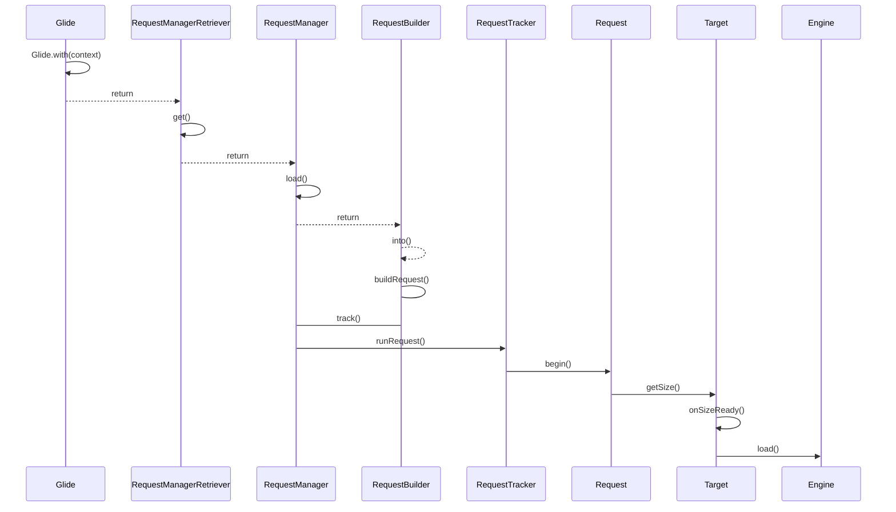
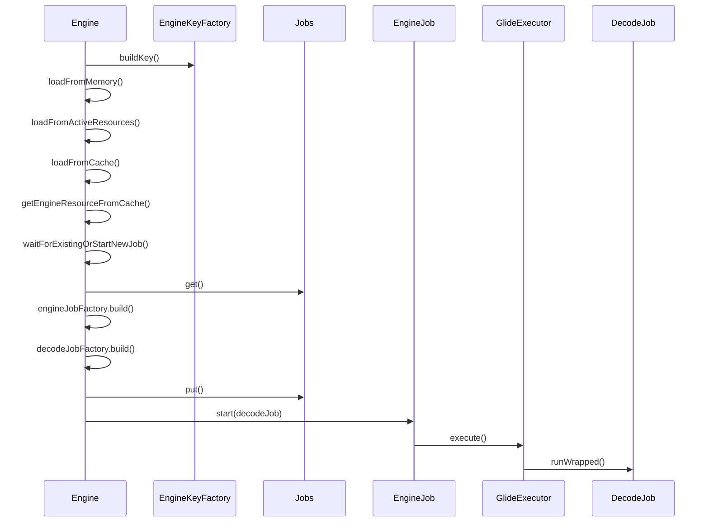

# 概述
Glide是Android使用最为广泛的图片加载库，Glie优势在于链式调用，支持解码多种图片格式，甚至支持视频解析，实现了多级缓存，减少oom的发生的同时提高了解码效率，易于扩展有丰富的自定义接口。

# 源码

本文源码分析基于glide版本4.12.0：

从`Glide.with(activity).load(url).centercrop().into(imageView);`说起。


关键方法`Engine.load()`,官方注释如下：
>* Check the current set of actively used resources, return the active resource if present,and move any newly inactive resources into the memory cache.
>检查当前活动使用的资源集，返回活动资源（如果存在），并将任何新的非活动资源移动到内存缓存中。
>*   Check the memory cache and provide the cached resource if present.
>检查内存缓存并提供缓存的资源（如果存在）
>*   Check the current set of in progress loads and add the cb to the in progress load if one is present.
>检查当前进行中负载集，并将 cb 添加到进行中负载（如果存在）。
>*   Start a new load.
>开始新加载。



`DecodeJob`工作模式其实是个状态机，状态枚举类是`RunReason`:
```java

private enum RunReason {
    /** The first time we've been submitted. */
    //初始状态
    INITIALIZE,
    /** We want to switch from the disk cache service to the source executor. */
    //从diskcache切换到源地址
    SWITCH_TO_SOURCE_SERVICE,
    /**
     * We retrieved some data on a thread we don't own and want to switch back to our thread to
     * process the data.
     */
     //解码处理数据
    DECODE_DATA,
  }
  
  private void runWrapped() {
    switch (runReason) {
      //首次运行走这个分支
      case INITIALIZE:
        stage = getNextStage(Stage.INITIALIZE);
        currentGenerator = getNextGenerator();
        runGenerators();
        break;
      //切换到获取源数据
      case SWITCH_TO_SOURCE_SERVICE:
        runGenerators();
        break;
      //解码数据
      case DECODE_DATA:
        decodeFromRetrievedData();
        break;
      default:
        throw new IllegalStateException("Unrecognized run reason: " + runReason);
    }
  }
  
  private Stage getNextStage(Stage current) {
    switch (current) {
      //判断是否从已解码缓存获取数据，否则从未解码缓存获取数据
      case INITIALIZE:
        return diskCacheStrategy.decodeCachedResource()
            ? Stage.RESOURCE_CACHE
            : getNextStage(Stage.RESOURCE_CACHE);
      //从已解码缓存获取数据
      case RESOURCE_CACHE:
        return diskCacheStrategy.decodeCachedData()
            ? Stage.DATA_CACHE
            : getNextStage(Stage.DATA_CACHE);
      //从未解码缓存获取数据
      case DATA_CACHE:
        // Skip loading from source if the user opted to only retrieve the resource from cache.
        return onlyRetrieveFromCache ? Stage.FINISHED : Stage.SOURCE;
      case SOURCE:
      case FINISHED:
        return Stage.FINISHED;
      default:
        throw new IllegalArgumentException("Unrecognized stage: " + current);
    }
  }
  
  //根据当前状态获取Generator
  private DataFetcherGenerator getNextGenerator() {
    switch (stage) {
      case RESOURCE_CACHE:
        return new ResourceCacheGenerator(decodeHelper, this);
      case DATA_CACHE:
        return new DataCacheGenerator(decodeHelper, this);
      case SOURCE:
        return new SourceGenerator(decodeHelper, this);
      case FINISHED:
        return null;
      default:
        throw new IllegalStateException("Unrecognized stage: " + stage);
    }
  }
  //执行Generator
  private void runGenerators() {
    currentThread = Thread.currentThread();
    startFetchTime = LogTime.getLogTime();
    boolean isStarted = false;
    //这里循环，一直运行直到走完所有Stage
    while (!isCancelled
        && currentGenerator != null
        && !(isStarted = currentGenerator.startNext())) {
      stage = getNextStage(stage);
      currentGenerator = getNextGenerator();

      //走到Source，重新执行DecodeJob，runReason为RunReason.SWITCH_TO_SOURCE_SERVICE
      if (stage == Stage.SOURCE) {
        reschedule();
        return;
      }
    }
    // We've run out of stages and generators, give up.
    if ((stage == Stage.FINISHED || isCancelled) && !isStarted) {
      notifyFailed();
    }

    // Otherwise a generator started a new load and we expect to be called back in
    // onDataFetcherReady.
  }
```

