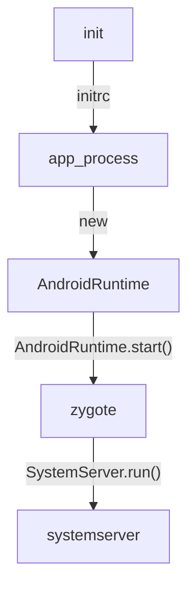

# Android启动流程分析
本文基于aosp/android-12.0.0_r34源码分析,


init进程是Linux用户空间的第一个进程，init启动后解析init.rc并启动对应的进程。

一些Android底层服务就是在init.rc中配置，并且有`init`程序负责启动的，例如：
`zygote`、`surfaceflinger`、`servicemanager`、`media`等等...

zygote负责启动systemserver和孵化app进程，接下来就分析`zygote`、`systemserver`、以及app进程启动的流程。


以下是`init.rc`中zygote的启动配置：
```shell
service zygote /system/bin/app_process -Xzygote /system/bin --zygote --start-system-server
    class main
    priority -20
    user root
    group root readproc reserved_disk
    socket zygote stream 660 root system
    socket usap_pool_primary stream 660 root system
    onrestart exec_background - system system -- /system/bin/vdc volume abort_fuse
    onrestart write /sys/power/state on
    onrestart restart audioserver
    onrestart restart cameraserver
    onrestart restart media
    onrestart restart media.tuner
    onrestart restart netd
    onrestart restart wificond
    task_profiles ProcessCapacityHigh
    critical window=${zygote.critical_window.minute:-off} target=zygote-fatal

```

可以看到zygote的二进制文件名是`/system/bin/app_process`，其对应的源码位置是`frameworks/base/cmds/app_process/app_main.cpp`,

```cpp
int main(int argc, char* const argv[])
{

    ...
    
    AppRuntime runtime(argv[0], computeArgBlockSize(argc, argv));
    // Process command line arguments
    // ignore argv[0]
    argc--;
    argv++;
    
    //省略一些参数处理过程
    ...
    
    //设置进程名、主线程名为zygote
    if (!niceName.isEmpty()) {
        runtime.setArgv0(niceName.string(), true /* setProcName */);
    }

    //前面参数如果指定了“--zygote”这里的zygote就是true，代表启动zygote
    if (zygote) {
        runtime.start("com.android.internal.os.ZygoteInit", args, zygote);
    } else if (!className.isEmpty()) {
        runtime.start("com.android.internal.os.RuntimeInit", args, zygote);
    } else {
        fprintf(stderr, "Error: no class name or --zygote supplied.\n");
        app_usage();
        LOG_ALWAYS_FATAL("app_process: no class name or --zygote supplied.");
    }

}

```

可一个看到最终都会调用`AppRuntime.start()`来启动对应的初始化类，`AppRuntime`是`AndroidRuntime`的子类，`start()`方法实现在父类`AndroidRuntime`中，在这个方法中会：
1、加载`libart.so`
2、初始化JNI接口
3、创建虚拟机运行时
4、执行`AndroidRuntime`内相关回调方法
5、然后调用Java类的`main()`方法

以下是关键代码：

```java
void AndroidRuntime::start(const char* className, const Vector<String8>& options, bool zygote)
{
    //验证和获取一些参数
    ...
    
    /* start the virtual machine */
    
    //加载libart.so并初始化JNI接口
    JniInvocation jni_invocation;
    jni_invocation.Init(NULL);
    JNIEnv* env;
    //启动虚拟机创建运行时数据结构
    if (startVm(&mJavaVM, &env, zygote, primary_zygote) != 0) {
        return;
    }
    //虚拟机运行时创建成功
    onVmCreated(env);
    /*
     * Register android functions.
     */
    //注册一些JNI方法
    if (startReg(env) < 0) {
        ALOGE("Unable to register all android natives\n");
        return;
    }
    /*
     * Start VM.  This thread becomes the main thread of the VM, and will
     * not return until the VM exits.
     */
     //执行初始化类的main()方法，在app_main.cpp->main()中通过参数确定初始化类
    char* slashClassName = toSlashClassName(className != NULL ? className : "");
    jclass startClass = env->FindClass(slashClassName);
    if (startClass == NULL) {
        ALOGE("JavaVM unable to locate class '%s'\n", slashClassName);
        /* keep going */
    } else {
        //执行main()方法
        jmethodID startMeth = env->GetStaticMethodID(startClass, "main",
            "([Ljava/lang/String;)V");
        if (startMeth == NULL) {
            ALOGE("JavaVM unable to find main() in '%s'\n", className);
            /* keep going */
        } else {
            env->CallStaticVoidMethod(startClass, startMeth, strArray);
        }
    }
}

```
继续看下`startVm()`函数的逻辑：
```cpp
int AndroidRuntime::startVm(JavaVM** pJavaVM, JNIEnv** pEnv, bool zygote, bool primary_zygote)
{
    JavaVMInitArgs initArgs;
    //省略了参数解析和处理过程
    ···
    /*
     * Initialize the VM.
     *
     * The JavaVM* is essentially per-process, and the JNIEnv* is per-thread.
     * If this call succeeds, the VM is ready, and we can start issuing
     * JNI calls.
     */
    //在前面初始化JniInvocation时，这个JNI_CreateJavaVM虚拟机接口已经初始化
    if (JNI_CreateJavaVM(pJavaVM, pEnv, &initArgs) < 0) {
        ALOGE("JNI_CreateJavaVM failed\n");
        return -1;
    }

    return 0;
}

```
到此，虚拟机就已经成功启动了起来。`JNI_CreateJavaVM`是`libart.so`的导出函数，它的源码位于`art/runtime/jni/java_vm_ext.cc`中：
```java
extern "C" jint JNI_CreateJavaVM(JavaVM** p_vm, JNIEnv** p_env, void* vm_args) {
  ScopedTrace trace(__FUNCTION__);
  const JavaVMInitArgs* args = static_cast<JavaVMInitArgs*>(vm_args);
  //判断jni版本
  if (JavaVMExt::IsBadJniVersion(args->version)) {
    LOG(ERROR) << "Bad JNI version passed to CreateJavaVM: " << args->version;
    return JNI_EVERSION;
  }
  //将JavaVMInitArgs转换为RuntimeOptions
  RuntimeOptions options;
  for (int i = 0; i < args->nOptions; ++i) {
    JavaVMOption* option = &args->options[i];
    options.push_back(std::make_pair(std::string(option->optionString), option->extraInfo));
  }
  bool ignore_unrecognized = args->ignoreUnrecognized;
  //创建虚拟机运行时 Runtime ，它是一个全局单例
  if (!Runtime::Create(options, ignore_unrecognized)) {
    return JNI_ERR;
  }
  // Initialize native loader. This step makes sure we have
  // everything set up before we start using JNI.
  //加载位于/etc/public.libraries.txt的系统库
  android::InitializeNativeLoader();
  
  Runtime* runtime = Runtime::Current();
  //启动运行时
  bool started = runtime->Start();
  if (!started) {
    delete Thread::Current()->GetJniEnv();
    delete runtime->GetJavaVM();
    LOG(WARNING) << "CreateJavaVM failed";
    return JNI_ERR;
  }
  //出参
  *p_env = Thread::Current()->GetJniEnv();
  *p_vm = runtime->GetJavaVM();
  return JNI_OK;
}
```
可以清楚地看到vm的整个创建逻辑，但是`AndroidRuntime`还有一些回调没有分析，看看它们具体做了些什么事情。
`AndroidRuntime.onVmCreated()`是一个空实现：
```cpp
void AndroidRuntime::onVmCreated(JNIEnv* env)
{
    // If AndroidRuntime had anything to do here, we'd have done it in 'start'.
}
```
其具体实现在其子类`AppRuntime`中：
```java
if (mClassName.isEmpty()) {
   return; // Zygote. Nothing to do here.
}
char* slashClassName = toSlashClassName(mClassName.string());
mClass = env->FindClass(slashClassName);
if (mClass == NULL) {
   ALOGE("ERROR: could not find class '%s'\n", mClassName.string());
}
free(slashClassName);

mClass = reinterpret_cast<jclass>(env->NewGlobalRef(mClass));
```
如果`app_process`的启动模式不是启动`zygote`的话，那么启动命令中应该设置一个启动类，在`app_main.cpp->main()`中调用`AppRuntime.setClassNameAndArgs()`保存启动类名以及启动参数。

如果`mClassName`不为空就说明设置了启动类，那么就在这个函数内将启动类加载进来。

也就是说，`app_process`可以用于启动`zygote`也可以用于启动普通的`dex`文件，如果启动普通的dex文件还需要指定其启动类名。

```java
    
    //zygote模式启动类为ZygoteInit，其内部使用RuntimeInit来初始化虚拟机环境
    if (zygote) {
        runtime.start("com.android.internal.os.ZygoteInit", args, zygote);
    } else if (className) {
        //非zygote模式使用RuntimeInit初始化虚拟机环境之后调用，className的main()方法
        runtime.start("com.android.internal.os.RuntimeInit", args, zygote);
    } else {
        fprintf(stderr, "Error: no class name or --zygote supplied.\n");
        app_usage();
        LOG_ALWAYS_FATAL("app_process: no class name or --zygote supplied.");
    }
```
对于非`zygote`模式启动的进程，其初始化类为`RuntimeInit`，其源码为：
```java
    
    public static final void main(String[] argv) {
        preForkInit();
        if (argv.length == 2 && argv[1].equals("application")) {
            if (DEBUG) Slog.d(TAG, "RuntimeInit: Starting application");
            //将标准输出流重定位到Android Log流
            redirectLogStreams();
        } else {
            if (DEBUG) Slog.d(TAG, "RuntimeInit: Starting tool");
        }
        //通用初始化
        commonInit();

        /*
         * Now that we're running in interpreted code, call back into native code
         * to run the system.
         */
         //初始化完成
        nativeFinishInit();

        if (DEBUG) Slog.d(TAG, "Leaving RuntimeInit!");
    }
```
`nativeFinishInit();`的JNI实现在`AndroidRuntime.cpp`中:
```cpp
static void com_android_internal_os_RuntimeInit_nativeFinishInit(JNIEnv* env, jobject clazz)
{   
    //回调AndroidRuntime.onStarted()
    gCurRuntime->onStarted();
}
```
可以看到，最终非zygote模式启动的进程，会回调`AndroidRuntime.onStarted()`，它在`AndroidRuntime`中是一个纯虚函数，其实现在`AppRuntime`中：
```cpp
    virtual void onStarted()
    {
        //启动binder线程池
        sp<ProcessState> proc = ProcessState::self();
        ALOGV("App process: starting thread pool.\n");
        proc->startThreadPool();
        //调用启动类的main()方法
        AndroidRuntime* ar = AndroidRuntime::getRuntime();
        ar->callMain(mClassName, mClass, mArgs);
        //main方法执行结束，销毁binder线程池
        IPCThreadState::self()->stopProcess();
        hardware::IPCThreadState::self()->stopProcess();
    }

```
对于zygote模式启动的进程而言其初始化类为`ZygoteInit`，`ZygoteInit`主要做三件事：
1、创建ZygoteServer
2、fork SystemServer
3、ZygoteServer开启监听
4、fork App进程后执行App进程的初始化逻辑

```java

public static void main(String[] argv) {

    //解析和设置一些参数，设置Zygote一些初始状态
    ...
    //创建ZygoteServer，内部封装了LocalSocket监听和数据处理相关逻辑
    zygoteServer = new ZygoteServer(isPrimaryZygote);
    //启动SystemServer
    if (startSystemServer) {
        //如果指定了"--start-system-server"参数
        //使用fork来创建SystemServer进程
        Runnable r = forkSystemServer(abiList, zygoteSocketName, zygoteServer);
        //父进程（Zygote）返回值是null
        // {@code r == null} in the parent (zygote) process, and {@code r != null} in the
        // child (system_server) process.
        //子进程（SystemServer）的返回值不为null，初始化SystemServer
        if (r != null) {
            r.run();
            return;
        }
    }
    
    Log.i(TAG, "Accepting command socket connections");

    // The select loop returns early in the child process after a fork and
    // loops forever in the zygote.
    //ZygoteServer开始使用select监听事件，当监听到AMS发出的启动新的App进程请求时，内部就会从这个方法中返回
    caller = zygoteServer.runSelectLoop(abiList);
    
    
    // We're in the child process and have exited the select loop. Proceed to execute the command.
    //在子进程中执行这个Runnable，初始化App进程
    if (caller != null) {
        caller.run();
    }
}

```
透传给`SystemServer`的参数:
```java
        /* Hardcoded command line to start the system server */
        String[] args = {
                "--setuid=1000",
                "--setgid=1000",
                "--setgroups=1001,1002,1003,1004,1005,1006,1007,1008,1009,1010,1018,1021,1023,"
                        + "1024,1032,1065,3001,3002,3003,3006,3007,3009,3010,3011",
                "--capabilities=" + capabilities + "," + capabilities,
                "--nice-name=system_server",
                "--runtime-args",
                "--target-sdk-version=" + VMRuntime.SDK_VERSION_CUR_DEVELOPMENT,
                "com.android.server.SystemServer",//主类
        };
```
然后看下`forkSystemServer()`方法的具体实现：
```java
private static Runnable forkSystemServer(String abiList, String socketName,
            ZygoteServer zygoteServer) {
        
        ...
        ZygoteArguments parsedArgs;

        int pid;

        try {

            ...
            
            /* Request to fork the system server process */
            //fork SystemServer
            pid = Zygote.forkSystemServer(
                    parsedArgs.mUid, parsedArgs.mGid,
                    parsedArgs.mGids,
                    parsedArgs.mRuntimeFlags,
                    null,
                    parsedArgs.mPermittedCapabilities,
                    parsedArgs.mEffectiveCapabilities);
        } catch (IllegalArgumentException ex) {
            throw new RuntimeException(ex);
        }

        /* For child process */
        if (pid == 0) {
            if (hasSecondZygote(abiList)) {
                waitForSecondaryZygote(socketName);
            }

            zygoteServer.closeServerSocket();
            //初始化SystemServer
            return handleSystemServerProcess(parsedArgs);
        }

        return null;
    }
    //继续分析
    private static Runnable handleSystemServerProcess(ZygoteArguments parsedArgs) {
        
        //启动zygote、SystemServer时并没有--invoke-with参数
        if (parsedArgs.mInvokeWith != null) {
            ...
        } else {
            ClassLoader cl = getOrCreateSystemServerClassLoader();
            if (cl != null) {
                Thread.currentThread().setContextClassLoader(cl);
            }

            /*
             * Pass the remaining arguments to SystemServer.
             */
            return ZygoteInit.zygoteInit(parsedArgs.mTargetSdkVersion,
                    parsedArgs.mDisabledCompatChanges,
                    parsedArgs.mRemainingArgs, cl);
        }

        /* should never reach here */
    }
    //继续分析
    public static Runnable zygoteInit(int targetSdkVersion, long[] disabledCompatChanges,
            String[] argv, ClassLoader classLoader) {
        if (RuntimeInit.DEBUG) {
            Slog.d(RuntimeInit.TAG, "RuntimeInit: Starting application from zygote");
        }

        Trace.traceBegin(Trace.TRACE_TAG_ACTIVITY_MANAGER, "ZygoteInit");
        //重定向标准输出流到日志流
        RuntimeInit.redirectLogStreams();
        //初始化一些公共配置
        RuntimeInit.commonInit();
        //最终会回调AndroidRuntime.onZygoteInit(),启动binder线程池
        ZygoteInit.nativeZygoteInit();
        return RuntimeInit.applicationInit(targetSdkVersion, disabledCompatChanges, argv,
                classLoader);
    }
    //继续分析
    protected static Runnable applicationInit(int targetSdkVersion, long[] disabledCompatChanges,
            String[] argv, ClassLoader classLoader) {
        
        ...

        // Remaining arguments are passed to the start class's static main
        //加载主类，加载main方法，这在启动参数中指定
        return findStaticMain(args.startClass, args.startArgs, classLoader);
    }
```

`SystemServer.java`主要方法是`run()`：
```java
private void run() {
//前面的逻辑主要是获取和设置一些系统属性以及初始状态
//创建一些必要对象例如Context、ActivityThread、Looper等
...
// Start services.
try {
    t.traceBegin("StartServices");
    //系统基础服务
    startBootstrapServices(t);
    //核心服务
    startCoreServices(t);
    //外围服务
    startOtherServices(t);
    startApexServices(t);
    } catch (Throwable ex) {
    Slog.e("System", "******************************************");
    Slog.e("System", "************ Failure starting system services", ex);
        throw ex;
    } finally {
        t.traceEnd(); // StartServices
    }
//其他操作
....
// Loop forever.
Looper.loop();
throw new RuntimeException("Main thread loop unexpectedly exited");
}

```
至此`SystemServer`就启动起来了。

下面我们再分析下`zygote`如何`fork`App进程。

在`ZygoteInit.main()`中启动事件循环:
```java
caller = zygoteServer.runSelectLoop(abiList);
```

```java
 Runnable runSelectLoop(String abiList) { 
 
    ...
     
    //监听LocalScoket
    while(true) {
    
        ...
        
        int pollReturnValue;
        try {
            pollReturnValue = Os.poll(pollFDs, pollTimeoutMs);
        } catch (ErrnoException ex) {
            throw new RuntimeException("poll failed", ex);
        }
    
    }
   
 }
```
下面是`Os.poll()`返回后的处理逻辑：
```cpp
while (--pollIndex >= 0) {
  //不是POLLIN事件，直接跳过
  if ((pollFDs[pollIndex].revents & POLLIN) == 0) {
    continue;
  }
  //zygote serversocket 有新的客户端连接
  if (pollIndex == 0) {
    // Zygote server socket
    ZygoteConnection newPeer = acceptCommandPeer(abiList);
    peers.add(newPeer);
    socketFDs.add(newPeer.getFileDescriptor());
  } 
  //客户端发送数据过来
  else if (pollIndex < usapPoolEventFDIndex) {
    try {
      ZygoteConnection connection = peers.get(pollIndex);
      boolean multipleForksOK = !isUsapPoolEnabled() &&
                                ZygoteHooks.isIndefiniteThreadSuspensionSafe();
      //处理客户端命令
      final Runnable command = connection.processCommand(this, multipleForksOK);

      if (mIsForkChild) {
        if (command == null) {
          throw new IllegalStateException("command == null");
        }

        return command;
      } else {
        if (command != null) {
          throw new IllegalStateException("command != null");
        }
        if (connection.isClosedByPeer()) {
          connection.closeSocket();
          peers.remove(pollIndex);
          socketFDs.remove(pollIndex);
        }
      }
    } catch (Exception e) {
      if (!mIsForkChild) {

        Slog.e(TAG, "Exception executing zygote command: ", e);

        ZygoteConnection conn = peers.remove(pollIndex);
        conn.closeSocket();

        socketFDs.remove(pollIndex);
      } else {
        Log.e(TAG, "Caught post-fork exception in child process.", e);
        throw e;
      }
    } finally {
      mIsForkChild = false;
    }

  } 
  //处理usap的相关逻辑
  else {
    long messagePayload;

    try {
      byte[] buffer = new byte[Zygote.USAP_MANAGEMENT_MESSAGE_BYTES];
      //读取usap已使用的进程，以便删除在Natvie中缓存的进程引用
      int readBytes = Os.read(pollFDs[pollIndex].fd, buffer, 0, buffer.length)
      if (readBytes == Zygote.USAP_MANAGEMENT_MESSAGE_BYTES) {
        DataInputStream inputStream =
            new DataInputStream(new ByteArrayInputStream(buffer));

        messagePayload = inputStream.readLong();
      } else {
        Log.e(TAG,
              "Incomplete read from USAP management FD of size " + readBytes);
        continue;
      }
    } catch (Exception ex) {
      if (pollIndex == usapPoolEventFDIndex) {
        Log.e(TAG,
              "Failed to read from USAP pool event FD: " + ex.getMessage());
      } else {
        Log.e(TAG,
              "Failed to read from USAP reporting pipe: " + ex.getMessage());
      }

      continue;
    }
    //删除
    if (pollIndex > usapPoolEventFDIndex) {
      Zygote.removeUsapTableEntry((int)messagePayload);
    }

    usapPoolFDRead = true;
  }
}
```

USAP是什么呢？它是Android 10(Q)引入的一种应用启动机制，传统启动模式由system_server中的AMS通过socket请求zygote fork新进程。USAP(Unspecialized App Process)则是由zygote提前fork一批进程，当AMS需要请求启动新进程时先向USAP socket发送请求，当缓存的进程池中没有可用进程时才走老的zygote应用启动流程。

这点从`ZygoteProcess`类中也可以得知：

```java

private Process.ProcessStartResult zygoteSendArgsAndGetResult(
            ZygoteState zygoteState, int zygotePolicyFlags, @NonNull ArrayList<String> args)
            throws ZygoteStartFailedEx {
        
        ...

        //尝试usap启动进程
        if (shouldAttemptUsapLaunch(zygotePolicyFlags, args)) {
            try {
                return attemptUsapSendArgsAndGetResult(zygoteState, msgStr);
            } catch (IOException ex) {
                // If there was an IOException using the USAP pool we will log the error and
                // attempt to start the process through the Zygote.
                Log.e(LOG_TAG, "IO Exception while communicating with USAP pool - "
                        + ex.getMessage());
            }
        }
        //尝试通过传统zygote启动
        return attemptZygoteSendArgsAndGetResult(zygoteState, msgStr);
    }
```

下面是通过USAP启动进程和通过传统zygote启动进程的对比：
```java
 //通过usap启动进程
 private Process.ProcessStartResult attemptUsapSendArgsAndGetResult(
            ZygoteState zygoteState, String msgStr)
            throws ZygoteStartFailedEx, IOException {
        //建立与usap serversocket的连接
        try (LocalSocket usapSessionSocket = zygoteState.getUsapSessionSocket()) {
            final BufferedWriter usapWriter =
                    new BufferedWriter(
                            new OutputStreamWriter(usapSessionSocket.getOutputStream()),
                            Zygote.SOCKET_BUFFER_SIZE);
            final DataInputStream usapReader =
                    new DataInputStream(usapSessionSocket.getInputStream());
            //向usap写入启动命令
            usapWriter.write(msgStr);
            usapWriter.flush();

            Process.ProcessStartResult result = new Process.ProcessStartResult();
            //读出pid
            result.pid = usapReader.readInt();
            // USAPs can't be used to spawn processes that need wrappers.
            result.usingWrapper = false;
            //pid大于0说明启动成功，将结果返回
            if (result.pid >= 0) {
                return result;
            } else {
                throw new ZygoteStartFailedEx("USAP specialization failed");
            }
        }
    }
//通过传统zygote启动进程  
private Process.ProcessStartResult attemptZygoteSendArgsAndGetResult(
            ZygoteState zygoteState, String msgStr) throws ZygoteStartFailedEx {
        try {
            final BufferedWriter zygoteWriter = zygoteState.mZygoteOutputWriter;
            final DataInputStream zygoteInputStream = zygoteState.mZygoteInputStream;
            //向zygote的 socketserver 写入启动命令
            zygoteWriter.write(msgStr);
            zygoteWriter.flush();

            // Always read the entire result from the input stream to avoid leaving
            // bytes in the stream for future process starts to accidentally stumble
            // upon.
            Process.ProcessStartResult result = new Process.ProcessStartResult();
            //读出pid
            result.pid = zygoteInputStream.readInt();
            result.usingWrapper = zygoteInputStream.readBoolean();

            if (result.pid < 0) {
                throw new ZygoteStartFailedEx("fork() failed");
            }

            return result;
        } catch (IOException ex) {
            zygoteState.close();
            Log.e(LOG_TAG, "IO Exception while communicating with Zygote - "
                    + ex.toString());
            throw new ZygoteStartFailedEx(ex);
        }
    }
```

下面看看传统zygote与usap分别是如何fork进程的，传统zygoteserver在`Os.poll()`返回后处理客户端数据：
```java
//处理客户端命令
      final Runnable command = connection.processCommand(this, multipleForksOK);
```
我们只关注创建进程相关的逻辑过程，不关系其他命令的处理过程，所以我将`processCommand()`精简一下:
```java
    Runnable processCommand(ZygoteServer zygoteServer, boolean multipleOK) {
        ZygoteArguments parsedArgs;

        try (ZygoteCommandBuffer argBuffer = new ZygoteCommandBuffer(mSocket)) {
            while (true) {
               
                //此处省略很多命令处理过程
                ...

                int pid;
                //传统zygote fork新进程
                if (parsedArgs.mInvokeWith != null || parsedArgs.mStartChildZygote
                        || !multipleOK || peer.getUid() != Process.SYSTEM_UID) {
                    // Continue using old code for now. TODO: Handle these cases in the other path.
                    // fork 子进程并且使用提供的参数初始化子进程
                    pid = Zygote.forkAndSpecialize(parsedArgs.mUid, parsedArgs.mGid,
                            parsedArgs.mGids, parsedArgs.mRuntimeFlags, rlimits,
                            parsedArgs.mMountExternal, parsedArgs.mSeInfo, parsedArgs.mNiceName,
                            fdsToClose, fdsToIgnore, parsedArgs.mStartChildZygote,
                            parsedArgs.mInstructionSet, parsedArgs.mAppDataDir,
                            parsedArgs.mIsTopApp, parsedArgs.mPkgDataInfoList,
                            parsedArgs.mAllowlistedDataInfoList, parsedArgs.mBindMountAppDataDirs,
                            parsedArgs.mBindMountAppStorageDirs);

                    try {
                        if (pid == 0) {
                            // in child
                            zygoteServer.setForkChild();

                            zygoteServer.closeServerSocket();
                            IoUtils.closeQuietly(serverPipeFd);
                            serverPipeFd = null;
                            //继续调用
                            //com.android.internal.os.ZygoteInit#zygoteInit->
                            //com.android.internal.os.RuntimeInit#applicationInit->
                            //com.android.internal.os.RuntimeInit#findStaticMain
                            return handleChildProc(parsedArgs, childPipeFd,
                                    parsedArgs.mStartChildZygote);
                        } else {
                            // In the parent. A pid < 0 indicates a failure and will be handled in
                            // handleParentProc.
                            IoUtils.closeQuietly(childPipeFd);
                            childPipeFd = null;
                            handleParentProc(pid, serverPipeFd);
                            return null;
                        }
                    } finally {
                        IoUtils.closeQuietly(childPipeFd);
                        IoUtils.closeQuietly(serverPipeFd);
                    }
                } else {
                    ZygoteHooks.preFork();
                    Runnable result = Zygote.forkSimpleApps(argBuffer,
                            zygoteServer.getZygoteSocketFileDescriptor(),
                            peer.getUid(), Zygote.minChildUid(peer), parsedArgs.mNiceName);
                    if (result == null) {
                        // parent; we finished some number of forks. Result is Boolean.
                        // We already did the equivalent of handleParentProc().
                        ZygoteHooks.postForkCommon();
                        // argBuffer contains a command not understood by forksimpleApps.
                        continue;
                    } else {
                        // child; result is a Runnable.
                        zygoteServer.setForkChild();
                        Zygote.setAppProcessName(parsedArgs, TAG);  // ??? Necessary?
                        return result;
                    }
                }
            }
        }
      
      ...
    }

```
对于usap，在ZygoteServer中处理逻辑如下：
```java
Runnable runSelectLoop(String abiList) {

    ...
    
    if (mUsapPoolRefillAction != UsapPoolRefillAction.NONE) {
    
        int[] sessionSocketRawFDs =
                        socketFDs.subList(1, socketFDs.size())
                                .stream()
                                .mapToInt(FileDescriptor::getInt$)
                                .toArray();

        final boolean isPriorityRefill = mUsapPoolRefillAction == UsapPoolRefillAction.IMMEDIATE;
        //根据mUsapPoolSizeMax，mUsapPoolSizeMin，mUsapPoolRefillThreshold等配置，计算需要fork的子进程数量
        final Runnable command = fillUsapPool(sessionSocketRawFDs, isPriorityRefill);

        if (command != null) {
            return command;
        } else if (isPriorityRefill) {
            // Schedule a delayed refill to finish refilling the pool.
            mUsapPoolRefillTriggerTimestamp = System.currentTimeMillis();
        }
     }
     
   
}
```
`fillUsapPool()`会调用到`Zygote.forkUsap()`：
```java
    Runnable fillUsapPool(int[] sessionSocketRawFDs, boolean isPriorityRefill) {
        
        ...

        while (--numUsapsToSpawn >= 0) {
            Runnable caller =
                    Zygote.forkUsap(mUsapPoolSocket, sessionSocketRawFDs, isPriorityRefill);

            if (caller != null) {
                return caller;
            }
        }

        ...

        return null;
    }

```
`Zygote.forkUsap()`:
```java
static @Nullable Runnable forkUsap(LocalServerSocket usapPoolSocket,
                                       int[] sessionSocketRawFDs,
                                       boolean isPriorityFork) {
        FileDescriptor readFD;
        FileDescriptor writeFD;

        try {
            FileDescriptor[] pipeFDs = Os.pipe2(O_CLOEXEC);
            readFD = pipeFDs[0];
            writeFD = pipeFDs[1];
        } catch (ErrnoException errnoEx) {
            throw new IllegalStateException("Unable to create USAP pipe.", errnoEx);
        }
        //真正的fork逻辑在Native层实现，其源码位于：frameworks/base/core/jni/com_android_internal_os_Zygote.cpp
        int pid = nativeForkApp(readFD.getInt$(), writeFD.getInt$(),
                                sessionSocketRawFDs, /*argsKnown=*/ false, isPriorityFork);
        if (pid == 0) {
            IoUtils.closeQuietly(readFD);
            //fork出的子进程阻塞在这个方法内部，等待客户端通过Usap socketserver 透传初始化参数
            return childMain(null, usapPoolSocket, writeFD);
        } else if (pid == -1) {
            // Fork failed.
            return null;
        } else {
            // readFD will be closed by the native code. See removeUsapTableEntry();
            IoUtils.closeQuietly(writeFD);
            nativeAddUsapTableEntry(pid, readFD.getInt$());
            return null;
        }
    }
```
`Zygote.childMain()`：
```java
private static Runnable childMain(@Nullable ZygoteCommandBuffer argBuffer,
                                      @Nullable LocalServerSocket usapPoolSocket,
                                      FileDescriptor writePipe) {
        final int pid = Process.myPid();

        DataOutputStream usapOutputStream = null;
        ZygoteArguments args = null;

        ...

        LocalSocket sessionSocket = null;
        if (argBuffer == null) {
            //usap pool内的进程名字区分32位和64为，以usap开开始
            Process.setArgV0(Process.is64Bit() ? "usap64" : "usap32");

            ...

            while (true) {
                ZygoteCommandBuffer tmpArgBuffer = null;
                try {
                    //监听socket
                    sessionSocket = usapPoolSocket.accept();

                    usapOutputStream =
                            new DataOutputStream(sessionSocket.getOutputStream());
                    Credentials peerCredentials = sessionSocket.getPeerCredentials();
                    tmpArgBuffer = new ZygoteCommandBuffer(sessionSocket);
                    //这里居然是个bug，没想到Google工程师也会犯如此低级的错误，而且将此bug带到正式版。。。
                    //这里应该用tmpArgBuffer而不是argBuffer
                    //这个bug android 13 版本才得到修复
                    //android 10 11 此处实现逻辑与12有较大出入
                    args = ZygoteArguments.getInstance(argBuffer);
                    applyUidSecurityPolicy(args, peerCredentials);
                    // TODO (chriswailes): Should this only be run for debug builds?
                    validateUsapCommand(args);
                    break;
                } catch (Exception ex) {
                    Log.e("USAP", ex.getMessage());
                }
                // Re-enable SIGTERM so the USAP can be flushed from the pool if necessary.
                unblockSigTerm();
                IoUtils.closeQuietly(sessionSocket);
                IoUtils.closeQuietly(tmpArgBuffer);
                blockSigTerm();
            }
        } else {
            ...
        }
        if (args == null) {
            throw new AssertionError("Empty command line");
        }
        try {
            ...
            //初始化进程
            specializeAppProcess(args.mUid, args.mGid, args.mGids,
                                 args.mRuntimeFlags, rlimits, args.mMountExternal,
                                 args.mSeInfo, args.mNiceName, args.mStartChildZygote,
                                 args.mInstructionSet, args.mAppDataDir, args.mIsTopApp,
                                 args.mPkgDataInfoList, args.mAllowlistedDataInfoList,
                                 args.mBindMountAppDataDirs, args.mBindMountAppStorageDirs);

            Trace.traceEnd(Trace.TRACE_TAG_ACTIVITY_MANAGER);
            
            //com.android.internal.os.ZygoteInit#zygoteInit->
            //com.android.internal.os.RuntimeInit#applicationInit->
            //com.android.internal.os.RuntimeInit#findStaticMain
            return ZygoteInit.zygoteInit(args.mTargetSdkVersion,
                                         args.mDisabledCompatChanges,
                                         args.mRemainingArgs,
                                         null /* classLoader */);
        } finally {
            // Unblock SIGTERM to restore the process to default behavior.
            unblockSigTerm();
        }
    }
```
可以看到当客户端通过usapPoolSocket向usap进程池内的进程发送初始化参数时，系统会欢迎一个阻塞在`accept()`方法的进程相应请求，最终通过`specializeAppProcess`设置App进程的相关参数。

无论是传统的zygote启动方式，还是usap最终都会走到`com.android.internal.os.ZygoteInit#zygoteInit`->`com.android.internal.os.RuntimeInit#applicationInit`->`com.android.internal.os.RuntimeInit#findStaticMain`

`com.android.internal.os.RuntimeInit#findStaticMain`返回一个`MethodAndArgsCaller`，层层返回跳出`com.android.internal.os.ZygoteServer#runSelectLoop`最终返回到`com.android.internal.os.ZygoteInit#main`：
```java
        try {
            
            ...
            
            caller = zygoteServer.runSelectLoop(abiList);
        } catch (Throwable ex) {
            Log.e(TAG, "System zygote died with fatal exception", ex);
            throw ex;
        } finally {
            if (zygoteServer != null) {
                zygoteServer.closeServerSocket();
            }
        }

        // We're in the child process and have exited the select loop. Proceed to execute the
        // command.
        if (caller != null) {
            caller.run();
        }
```
最后执行`MethodAndArgsCaller#run`进入到`android.app.ActivityThread#main`，开始正式执行App内部代码。

