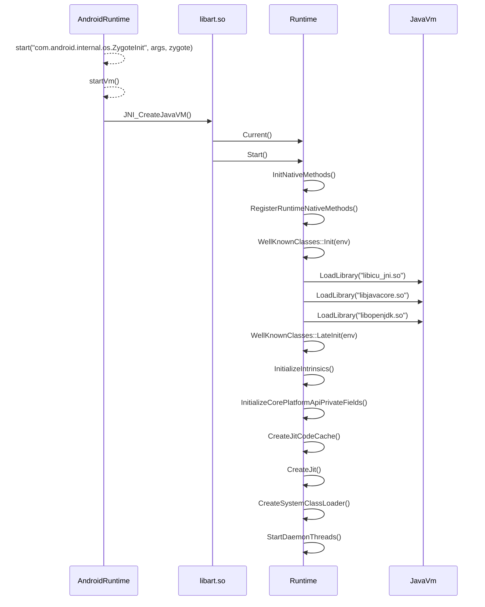

# ART启动过程

Zygote通过调用`AppRuntime.Start()`方法来启动`art runtime`。

在`AppRuntime.Start()`中又调用`startVm()`函数来启动虚拟机，在这两个函数中先是配置了许多启动参数，然后调用`libart.so`的导出函数`jint JNI_CreateJavaVM(JavaVM** p_vm, JNIEnv** p_env, void* vm_args)`来创建虚拟机并启动虚拟机。



```cpp
bool Runtime::Create(RuntimeArgumentMap&& runtime_options) {
  // TODO: acquire a static mutex on Runtime to avoid racing.
  if (Runtime::instance_ != nullptr) {
    return false;
  }
  instance_ = new Runtime;
  Locks::SetClientCallback(IsSafeToCallAbort);
  if (!instance_->Init(std::move(runtime_options))) {
    // TODO: Currently deleting the instance will abort the runtime on destruction. Now This will
    // leak memory, instead. Fix the destructor. b/19100793.
    // delete instance_;
    instance_ = nullptr;
    return false;
  }
  return true;
}
```


```cpp
bool Runtime::Init(RuntimeArgumentMap&& runtime_options_in) {

  MemMap::Init();

  {
    constexpr uintptr_t kSentinelAddr =
        RoundDown(static_cast<uintptr_t>(Context::kBadGprBase), kPageSize);
    protected_fault_page_ = MemMap::MapAnonymous("Sentinel fault page",
                                                 reinterpret_cast<uint8_t*>(kSentinelAddr),
                                                 kPageSize,
                                                 PROT_NONE,
                                                 /*low_4gb=*/ true,
                                                 /*reuse=*/ false,
                                                 /*reservation=*/ nullptr,
                                                 /*error_msg=*/ nullptr);


  oat_file_manager_ = new OatFileManager;
                runtime_options.GetOrDefault(Opt::StackDumpLockProfThreshold));

  SetInstructionSet(runtime_options.GetOrDefault(Opt::ImageInstructionSet));

    std::string error_msg;
    std::unique_ptr<OatFile> oat_file(OatFile::Open(/*zip_fd=*/ -1,
                                                    system_oat_filename,
                                                    system_oat_location,
                                                    /*executable=*/ false,
                                                    /*low_4gb=*/ false,
                                                    &error_msg));

  heap_ = new gc::Heap(...));

  const bool use_malloc = IsAotCompiler();
  if (use_malloc) {
    arena_pool_.reset(new MallocArenaPool());
    jit_arena_pool_.reset(new MallocArenaPool());
  } else {
    arena_pool_.reset(new MemMapArenaPool(/* low_4gb= */ false));
    jit_arena_pool_.reset(new MemMapArenaPool(/* low_4gb= */ false, "CompilerMetadata"));
  }

  if (IsAotCompiler() && Is64BitInstructionSet(kRuntimeISA)) {
    // 4gb, no malloc. Explanation in header.
    low_4gb_arena_pool_.reset(new MemMapArenaPool(/* low_4gb= */ true));
  }
  linear_alloc_.reset(CreateLinearAlloc());

  BlockSignals();
  InitPlatformSignalHandlers();

  std::string error_msg;
  java_vm_ = JavaVMExt::Create(this, runtime_options, &error_msg);
  if (java_vm_.get() == nullptr) {
    LOG(ERROR) << "Could not initialize JavaVMExt: " << error_msg;
    return false;
  }

  Thread::Startup();

  Thread* self = Thread::Attach("main", false, nullptr, false);

  if (UNLIKELY(IsAotCompiler())) {
    class_linker_ = new AotClassLinker(intern_table_);
  } else {
    class_linker_ = new ClassLinker(
        intern_table_,
        runtime_options.GetOrDefault(Opt::FastClassNotFoundException));
  }

  verifier::ClassVerifier::Init(class_linker_);


  VLOG(startup) << "Runtime::Init exiting";

  return true;
}

```

```cpp
bool Runtime::Start() {
  VLOG(startup) << "Runtime::Start entering";

  Thread* self = Thread::Current();

  self->TransitionFromRunnableToSuspended(kNative);

  DoAndMaybeSwitchInterpreter([=](){ started_ = true; });

  // InitNativeMethods needs to be after started_ so that the classes
  // it touches will have methods linked to the oat file if necessary.
  {
    ScopedTrace trace2("InitNativeMethods");
    InitNativeMethods();
  }

  // IntializeIntrinsics needs to be called after the WellKnownClasses::Init in InitNativeMethods
  // because in checking the invocation types of intrinsic methods ArtMethod::GetInvokeType()
  // needs the SignaturePolymorphic annotation class which is initialized in WellKnownClasses::Init.
  InitializeIntrinsics();

  // InitializeCorePlatformApiPrivateFields() needs to be called after well known class
  // initializtion in InitNativeMethods().
  art::hiddenapi::InitializeCorePlatformApiPrivateFields();

  // Initialize well known thread group values that may be accessed threads while attaching.
  InitThreadGroups(self);

  Thread::FinishStartup();

  if (jit_options_->UseJitCompilation() || jit_options_->GetSaveProfilingInfo()) {
    // Try to load compiler pre zygote to reduce PSS. b/27744947
    std::string error_msg;
    if (!jit::Jit::LoadCompilerLibrary(&error_msg)) {
      LOG(WARNING) << "Failed to load JIT compiler with error " << error_msg;
    }
    CreateJitCodeCache(/*rwx_memory_allowed=*/true);
    CreateJit();
  }


  system_class_loader_ = CreateSystemClassLoader(this);

  StartDaemonThreads();

  return true;
}

```