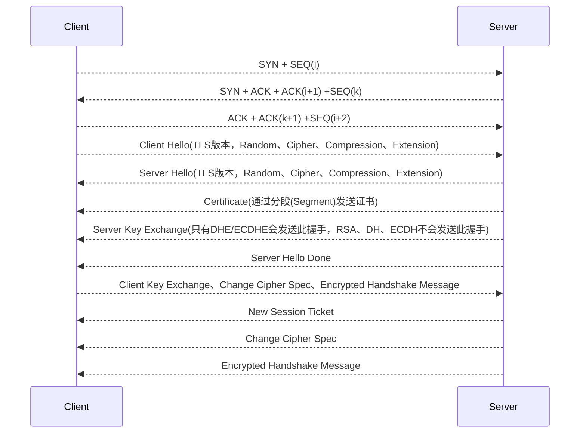
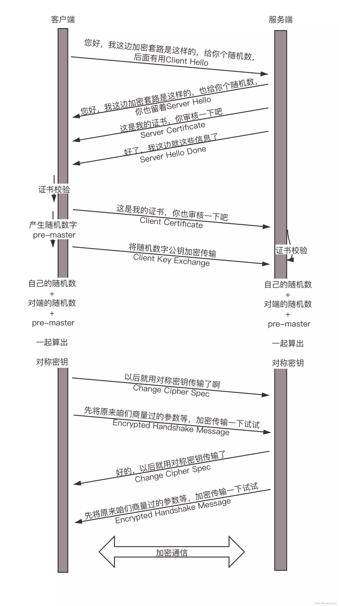

MTU：数据链路层传输最大数据单元，不包括MAC帧首部和尾部
路径MTU：数据传输链路层最小的MTU

IP分组：如果IP层数据（首部+数据）比MTU大，那么IP层需要对数据进行分组，之后再按照分组编号进行重组，形成完整的IP报文。

PMTU：当两台主机在网络中通信时，网络中设备MTU可能不同，两台主机通信路径中最小的MTU称为PMTU（Path mtu）。

RFC1191描述了PMTU的发现机制，即确定路径MTU的方法。ICMP的不可到达错误采用的就是这种方法， traceroute程序也是用这种方法来确定到达目的节点的PMT的。

MTU是网络调节的重要因素，因为包中的额外开销量相当高。高的MTU减少了头信息浪费的字节数。对大量数据传输尤其重要，而对小于MTU的传输没有影响。因此，注意配置传输大量数据流的服务器(如文件服务器和FTPH&．务器)上的MTU。 [5]

选择MTU时，规则是选择传输中不需分段的最大MTU。如果网络使用一种媒体类型，缺省的设置就可以。选择比媒体最大值更小的MTU并没有好处，整个数据报会因为每个包的错误而重发。换言之，不能重发单个段

IP协议除了具有路由寻址功能外，另一个重要的功能就是IP数据报的分片处理。每个数据链路层能够确定发送的一个帧的最大长度称为最大传输单元。在Ethernet中，MTU为1500字节;在FDDI中，MTU为4352字节;在 IP over AMT中，MTU为9180字节。

以太网和802.3对数据帧的长度都有一个限制，其最大值分别是1500字节和1492字节。链路层的这个特性称为MTU，即最大传输单元。不同类型网络的数帧长度大多数都有一个上限。如果IP层有一个数据报要传，而且数据帧的长度比链路层的MTU还大，那么IP层就需要进行分片( fragmentation)，即把数据报分成干片，这样每一片就都小于MTU.

TCP MSS（Maximum Segment Size，最大报文长度），是TCP协议定义的一个选项，MSS选项用于在TCP连接建立时，收发双方协商通信时每一个报文段所能承载的最大数据长度。
一旦DF位置一，(DF位为1的话则不允许分片）将不允许中间设备对该报文进行分片，那么在遇到IP报文长度超过中间设备转发接口的MTU值时，该IP报文将会被中间设备丢弃。在丢弃之后，中间设备会向发送方发送ICMP差错报文。

MSS为最大传输单元，表示TCP能够承载的最大数据长度

遇到的问题：
1、求代理数据流向如何？

2、代理通道设计问题，全双工

3、设计高效的buffer

设计：


https握手过程：
首先是TCP握手，建立连接后进行TLS握手




Android NDK Log:error: format string is not a string literal
```Cpp

//在后面加个0
LOGD(targetFileNameStr.data(), "123", 0);

```

4. 常用预定义宏
说明： 这些C++编译器内置的预定义宏不能被取消定义（#undef）也不能被编程人员重新定义。
```cpp
__DATE__代表日期，形式为Mmm dd yyyy 的字符串常量

__FILE__表示当前源文件名，类型为字符串常量

__TIME__代表时间，hh:mm:ss 形式的字符串型常量

__func__和__FUNCTION__都代表当前函数的函数名，类型为字符串常量

__LINE__代表当前程序行的行号，类型为十进制整数常量
```

关于epoll的ET（边缘触发模式）,可以利用epoll做一些精确的读写控制，
```
1. 对于读操作
（1）当缓冲区由不可读变为可读的时候，即缓冲区由空变为不空的时候。

（2）当有新数据到达时，即缓冲区中的待读数据变多的时候。

（3）当缓冲区有数据可读，且应用进程对相应的描述符进行EPOLL_CTL_MOD 修改EPOLLIN事件时。

2. 对于写操作
（1）当缓冲区由不可写变为可写时。

（2）当有旧数据被发送走，即缓冲区中的内容变少的时候。

（3）当缓冲区有空间可写，且应用进程对相应的描述符进行EPOLL_CTL_MOD 修改EPOLLOUT事件时。

```

直接将`char*`隐式转换为`std::string`是有风险的，会造成内容错落，具体原因未知。

`std::unique_lock`是不可重入锁，`std::recursive_mutex`是可重入锁。
网络编程需要注意的问题：
```
1、字节序问题，如果传入参数所用字节序不对，可能会引发非法参数问题，或者无法正确连接到目标服务器，在涉及数值计算的场景可能导致计算错误，设计数据长度的场景可能导致长度异常、缓冲区溢出等问题

2、函数返回值问题，如果返回值处理出错，可能导致意外的现象发生，比如非阻塞io中read/write的返回值处理

```

connect errno=13:Permission denied 一般是地址不合法引起的

# DNS解析

dns机制是客户端通过向DNS服务器发送DNS请求来查询域名主机IP地址。由于业务场景不同，DNS请求需要设置不同的记录类型。

* A记录：用于指定主机名和IP(v4)之间的映射关系
* AAAA记录：用于指定主机名和IP（v6）之间的映射关系
* CNAME记录：用于指定域名和域名之间的映射关系，它指向的是另一个域名而不是IP地址。
* NS记录：指向其他DNS服务器
* MX记录：邮件交换记录，用于解析邮箱，发送邮件时根据发件人的邮箱后缀定位到邮件服务器。
* TXT记录：标识和说明某个主机
* PTR记录：A记录的反向记录，IP映射到主机名
* SOA记录：标识NS记录中的主服务器，提供权威解析
* SRV记录：
* URL转发：将当前域名指向另个网络地址