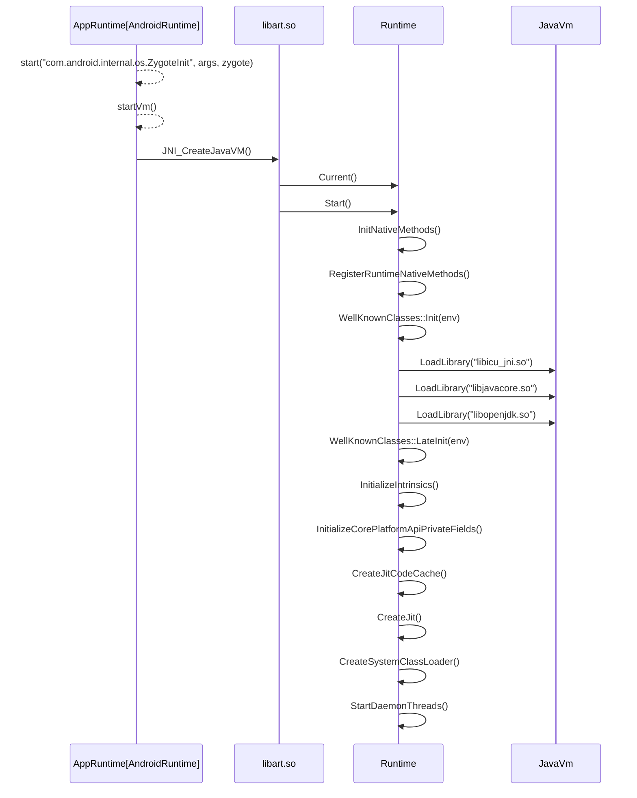

# ART启动过程

我们知道，Zygote通过调用`AppRuntime.Start()`来启动Android运行时。

在`AppRuntime.Start()`中又调用`startVm()`函数来启动虚拟机，在这两个函数中先是配置了许多启动参数，然后调用`libart.so`的导出函数`jint JNI_CreateJavaVM(JavaVM** p_vm, JNIEnv** p_env, void* vm_args)`来创建虚拟机并启动虚拟机。

在`Runtime.Start()`中，调用`InitNativeMethods()`来初始化`libart.so`
